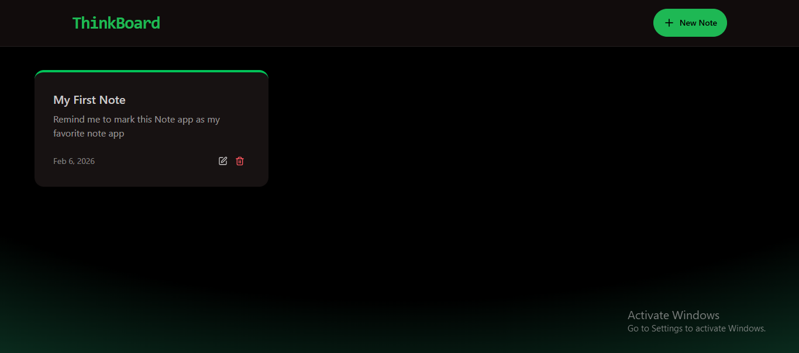
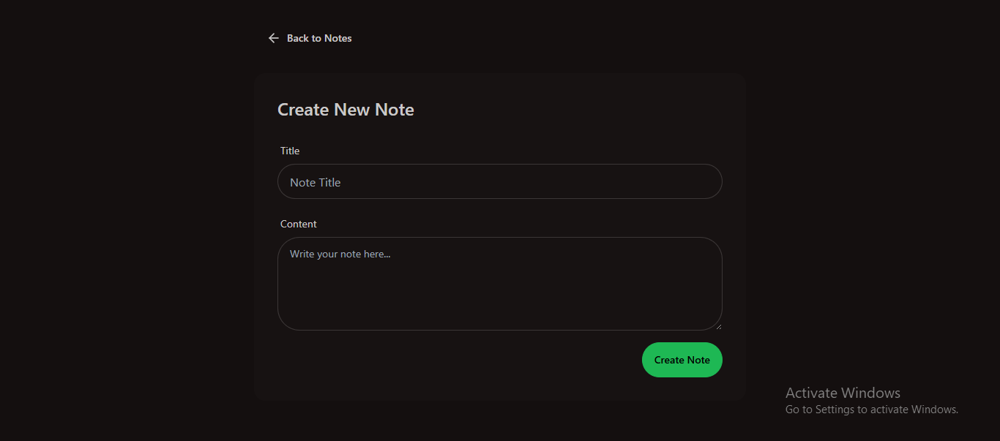
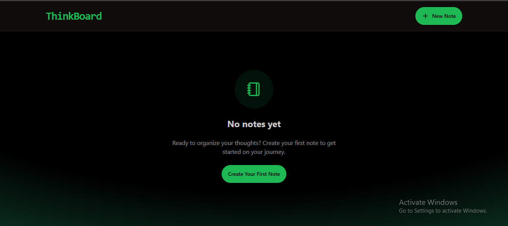
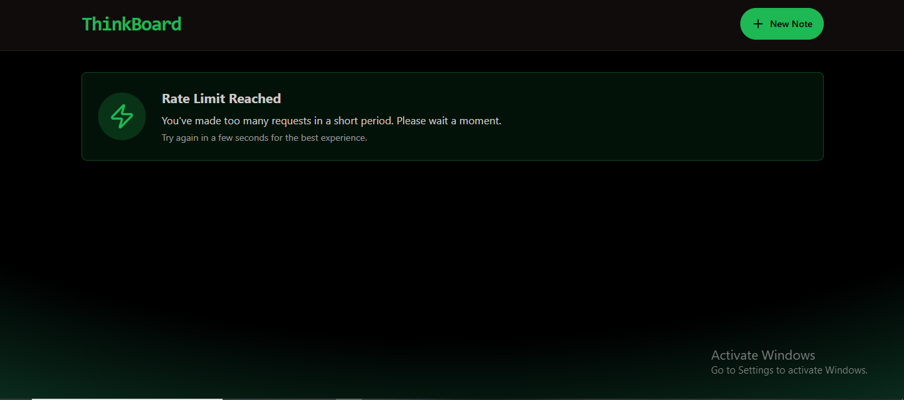

# 🧠 ThinkBoard — Full Stack Notes & Productivity App

ThinkBoard is a modern **full-stack MERN Notes Application** that allows users to securely create, manage, and organize notes with a clean UI, fast performance, and production-ready backend architecture.

Built with scalability, security, and real-world practices like **JWT authentication**, **rate limiting**, and structured API design.

---

## 🚀 Key Features

✅ Secure User Authentication (JWT)  
✅ Create, Read, Update, Delete Notes (Full CRUD)  
✅ Modern Responsive UI with React + Tailwind  
✅ Rate Limiting Middleware for API Protection  
✅ Clean REST API Architecture  
✅ Modular Folder Structure (Controllers, Routes, Models)  
✅ Axios-based API Integration  
✅ Ready for Deployment (Vercel + Render)

---

## 🛠 Tech Stack

### Frontend
- React.js (Vite)
- Tailwind CSS
- Axios
- Component-Based UI Design

### Backend
- Node.js
- Express.js
- MongoDB + Mongoose
- JWT Authentication
- Rate Limiting Middleware

---

## 📂 Project Structure

```bash
ThinkBoard/
│
├── backend/
│   ├── src/
│   │   ├── config/
│   │   │   ├── db.js
│   │   │   └── jwt.js
│   │   ├── controllers/
│   │   │   └── notesController.js
│   │   ├── middleware/
│   │   │   └── rateLimiter.js
│   │   ├── models/
│   │   │   └── Note.js
│   │   ├── routes/
│   │   │   └── notesRoutes.js
│   │   └── server.js
│   └── package.json
│
├── frontend/
│   ├── src/
│   │   ├── components/
│   │   │   ├── Navbar.jsx
│   │   │   ├── NoteCard.jsx
│   │   │   └── RateLimitedUI.jsx
│   │   ├── pages/
│   │   │   ├── HomePage.jsx
│   │   │   ├── CreatePage.jsx
│   │   │   └── NoteDetailPage.jsx
│   │   ├── lib/
│   │   │   ├── axios.js
│   │   │   └── utils.js
│   │   └── App.jsx
│   └── package.json
│
└── README.md

---

## ⚙️ Setup Instructions
- 1️⃣ Clone the Repository
git clone git@github-personal:geet182022-prog/- ThinkBoard.git
cd ThinkBoard

### 🔧 Backend Setup
cd backend 
npm install

- Create a .env file inside backend/:

MONGO_URI=your_mongodb_connection_string
JWT_SECRET=your_secret_key
PORT=5000


- Run backend server:
npm start

### Backend will run at:
http://localhost:5000

- 🎨 Frontend Setup

-Open another terminal:
cd frontend
npm install
npm run dev

- Frontend will run at:
http://localhost:5173

---

## 🔐 Security Features

- Password-protected user sessions using JWT
- API rate limiting to prevent abuse
- Environment variables secured via .env

---

## 📸 Screenshots

### 🏠 Dashboard


### ✍️ Create Note Page


### 📝 Edit Note Page


### 📭 Empty Notes State


### 🚦 Rate Limit Protection UI



---

### 🌍 Deployment (Coming Soon)

Frontend: Vercel
Backend: Render
Database: MongoDB Atlas

Live Demo Link will be added soon.

---  

### 👩‍💻 Author

Geetanjali
🔗 GitHub: geet182022-prog
🔗 LinkedIn: https://www.linkedin.com/in/geetanjali-96a099284